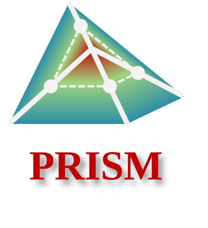

# PRISM Demonstration

<p align="center">
  
</p>

This repository provides a Windows-oriented demonstration package for PRISM, a single-photon 3D imaging reconstruction framework. The included example uses one Middlebury sample and the provided assets.

## Overview

<p align="center">
  
</p>

## Requirements

- Windows
- Python 3.10 is recommended
- A Python environment with the packages listed in `requirements.txt`

Install dependencies:

```powershell
pip install -r requirements.txt
```

If your environment requires a specific PyTorch build, install the appropriate PyTorch package first, then install the remaining dependencies.

## Run

From the repository root:

```powershell
python main.py
```

The script loads the included Middlebury sample (image resolution: 512×512, number of time bins: 1024), runs the PRISM demonstration pipeline, displays the reconstruction figure, and prints depth and intensity metrics.

## Project Structure

```text
main.py                         Entry point
requirements.txt                Runtime dependencies

prism/
  config.py                     Demo configuration
  metrics.py                    Metric calculation
  visualization.py              Result visualization
  pipeline.py                   Protected PRISM pipeline module
  data_io.py                    Protected data loading module
  assets.py                     Protected asset checking module
  _*.py                         Protected implementation modules

pyarmor_runtime_000000/         Runtime package required by protected modules

data/
  spad_Middlebury_Art.mat       Demonstration SPAD measurement

npy/
  Middlebury_128.npy            RFF projection asset 

pth/
  Middlebury_128.pth            Proxy network weights

model/
  Middlebury_128.model          K-means model asset

"128 is the number of time bins set for the signal detection interval (SDI)"
```

## Configuration

Basic runtime settings are defined in:

```text
prism/config.py
```

Common settings include:

- `data_path`
- `resolution`
- `sdi_length`
- `lir_window_size`
- `nsr_clusters`
- asset paths for the pretrained files

The included assets are configured for the provided Middlebury demonstration sample.

## Notes

- The `spad_Middlebury_Art.rar` compressed file in `data/` needs to be decompressed before use.
- Keep `pyarmor_runtime_000000/` in the repository root. The protected modules require it at runtime.
- Keep the `data/`, `npy/`, `pth/`, and `model/` folders in their default locations unless the paths in `prism/config.py` are updated.
- The protected modules are required for execution and are not plain source files.
